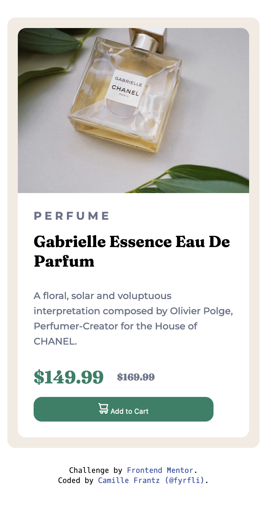
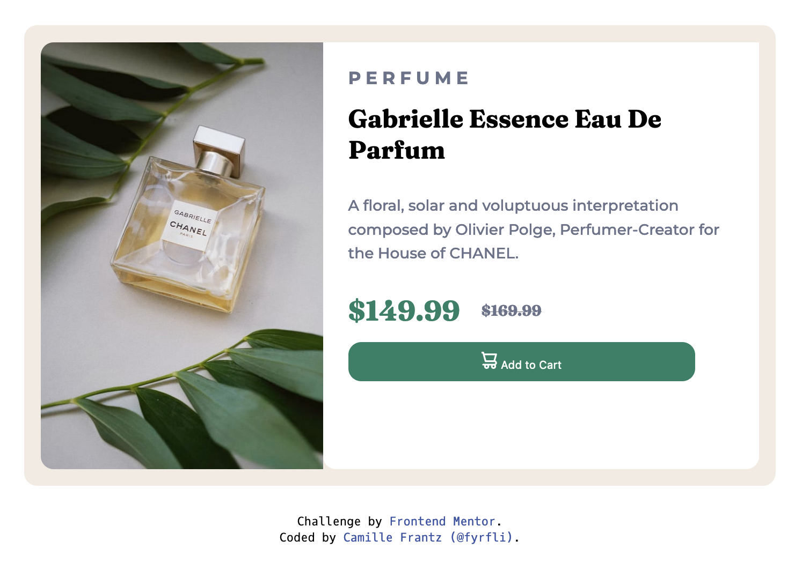

# Frontend Mentor - Product preview card component solution

[@fyrfli](https://www.frontendmentor.io/profile/fyrfli)'s solution to the [Product preview card component challenge on Frontend Mentor](https://www.frontendmentor.io/challenges/product-preview-card-component-GO7UmttRfa). Frontend Mentor challenges help you improve your coding skills by building realistic projects. 

### Screenshot

### Links

- Solution URL: [Code](https://github.com/fyrfli/product-preview-card)
- Live Site URL: [Live](https://fyrfli.github.io/product-preview-card)

- Semantic HTML5 markup
- CSS custom properties
- Flexbox
- Mobile-first workflow
- [Less CSS](https://lesscss.org)

### What I learned

I tried doing this with Bootstrap at first but found I needed too many customized styles for my limited Boostrap knowledge. TailwindCSS is far easier to use on projects like this than Bootstrap is ... at least so it seems to me at the moment. 

Further, I am so comfortable with Less at this point in time that it just seemed to be faster to get it done with Less. This took me just under 2 hours to complete.

### Continued development

I want to try to learn more Bootstrap to get it done using that framework that way I can even add some Javascript to the page as well. 

## Author

- Website - [Camille Frantz (@fyrfli)](https://fyrfli.io)
- Frontend Mentor - [@fyrfli](https://www.frontendmentor.io/profile/fyrfli)
- Twitter - [@fyrfli](https://www.twitter.com/fyrfli)
